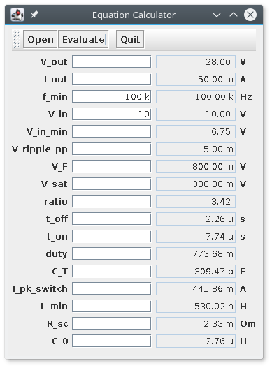

# eqcalc

Eqalc is a calculator program that simplify optimizing values for a
system of equations. It can be used to select values for some system
under complex restrictions when full optimization package is an
overkill.

Eqalc loads a file that contains a set of equations and creates gui
that allows editing input parameters and calculates output ones. The
input format is simple and no programming is required to create
gui. Additionally, the program understands prefixes of physical units.
The project is more of an exercise in clojure then a complete tool.

As example below there is a description of boost converter equations:

```
V_out = 28, V
I_out = 50, mA
f_min = 50, kHz

V_in = 9, V
V_in_min = 6.75, V
V_ripple_pp = 0.005

V_F = 0.8, V
V_sat = 0.3, V

ratio = (V_out + V_F - V_in_min)/(V_in_min - V_sat)
t_off = 1/(f_min*(1 + ratio)), s
t_on = ratio*t_off, s
duty = t_on/(t_on + t_off)

C_T = 4.0e-5*t_on, F
I_pk_switch = 2*I_out*(1 + ratio), A
L_min = t_on*I_pk_switch/(V_in_min - V_sat), H
R_sc = 0.33/t_on/((V_in - V_sat)/L_min), Om
C_0 = t_on*I_out/V_ripple_pp/V_out, H
```

